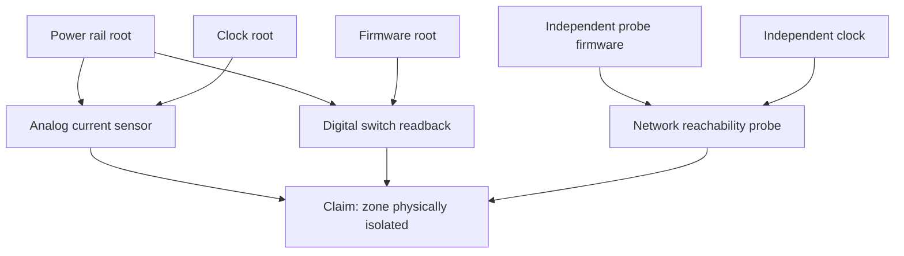
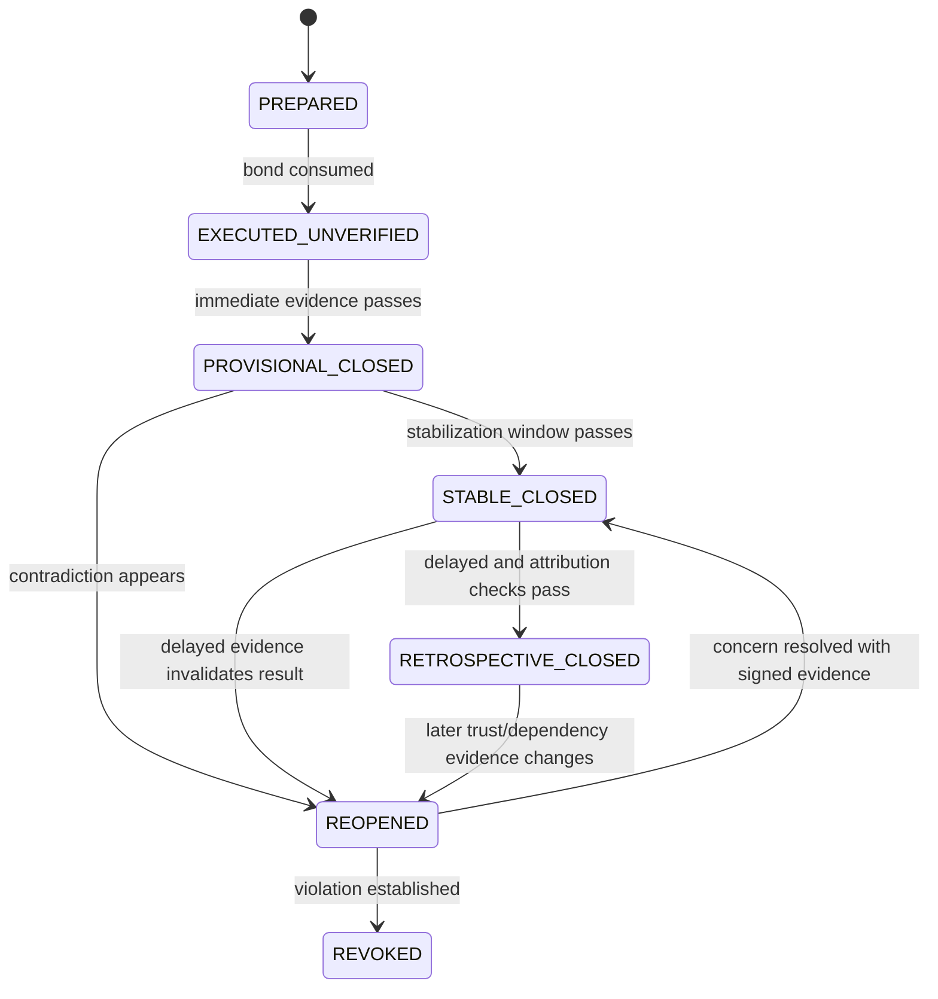
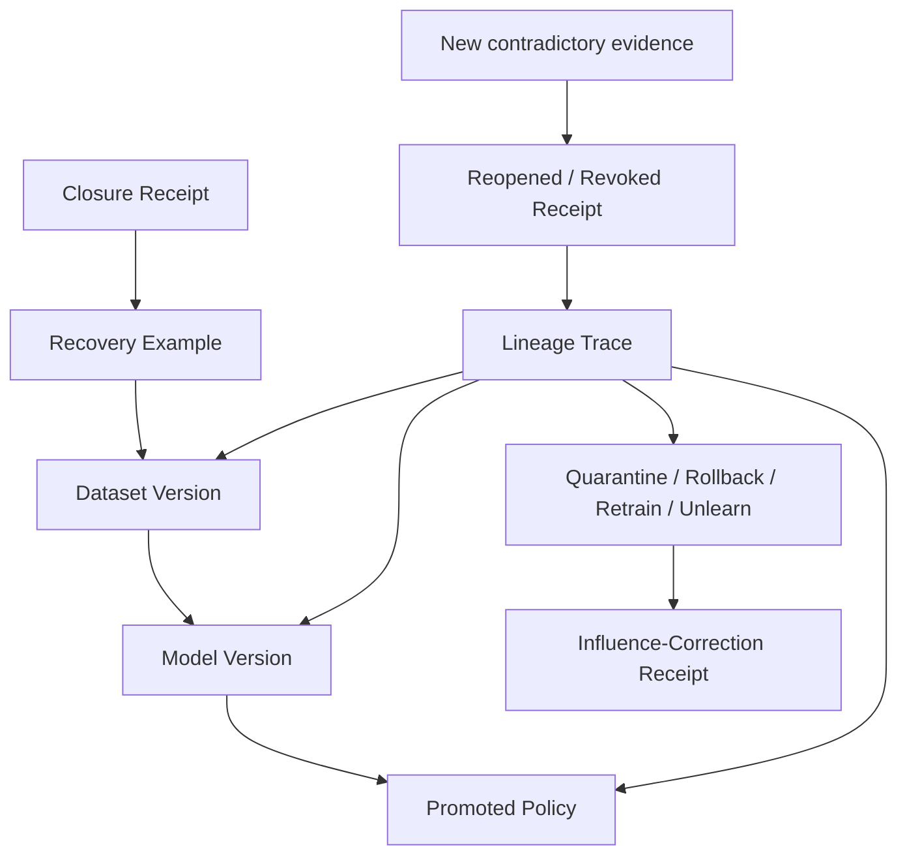

# Architecture and Patent-Review Diagrams

## Figure 1 — Complete transaction

```mermaid
flowchart LR
    E[Evidence Sources] --> CIP[Claim-Scoped Causal Independence Proof]
    CIP --> CSE[Canonical State Envelope]
    CSE --> RCC[Recovery Candidate Capsule]
    RCC --> DCOE[Dual Counterfactual Outcome Envelope]
    DCOE --> PR[Proof and Refutation Gate]
    PR --> RAB[One-Time Recovery Actuation Bond]
    RAB --> ACT[Physical or Digital Actuator]
    ACT --> OBS[Independent Multi-Horizon Observations]
    OBS --> OCR[Closure / Superseding Receipt]
    OCR --> RLL[Revocable Learning Lineage]
```



## Figure 2 — Causal evidence dependency



## Figure 3 — Dual outcome branches

```mermaid
flowchart LR
    S[Bound pre-action state] --> IA[Intervention branch do(a)]
    S --> FA[Fallback branch do(a0)]
    IA --> SAFE1[Safety and benefit envelope]
    FA --> SAFE0[Safe-hold envelope]
    SAFE1 --> SEP[Branch separation and uncertainty test]
    SAFE0 --> SEP
    SEP -->|Pass| BOND[Actuation bond eligible]
    SEP -->|Fail| HOLD[Hold, reduce action, or escalate]
```

## Figure 4 — Multi-horizon closure



## Figure 5 — Learning influence correction



